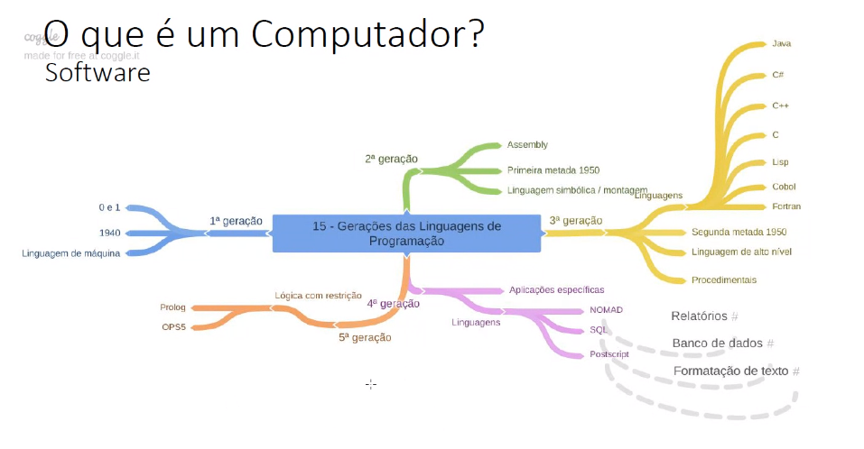
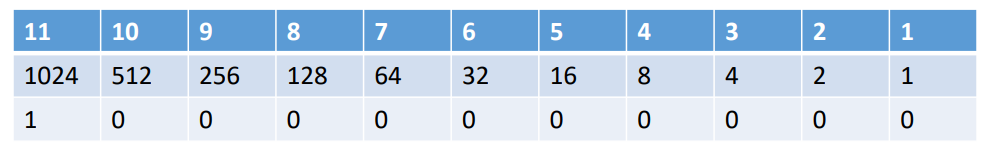
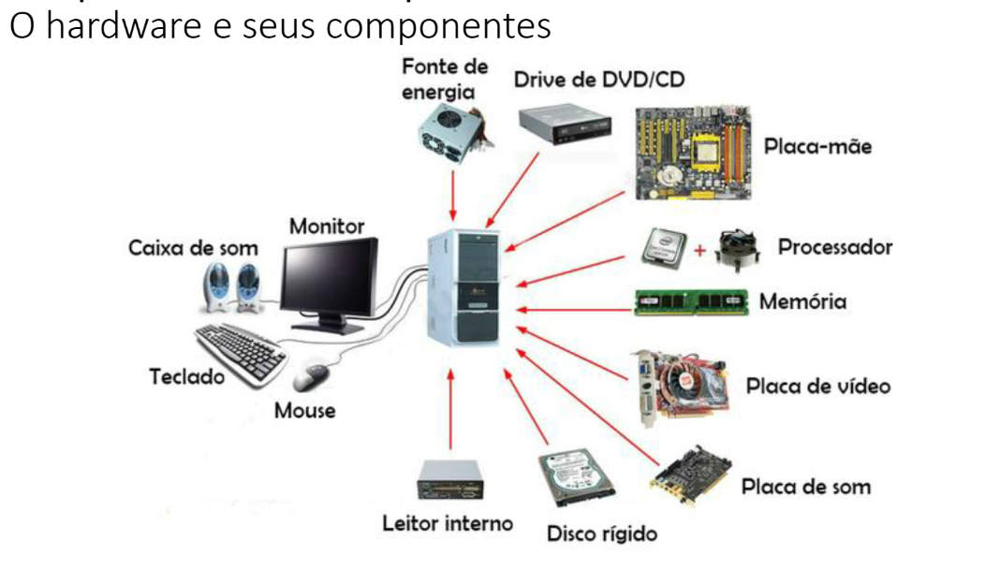
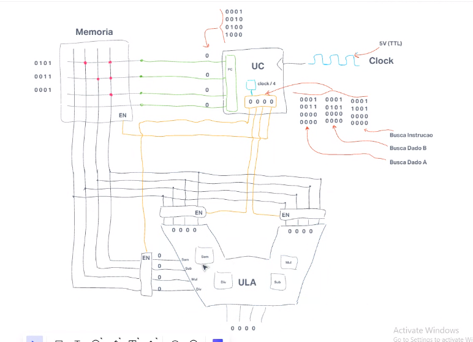

Sumário
- [Lógica de Programação](#lógica-programação)
- [Anotações Gerais JS](#anotações-gerais)
- [Introdução JS](#introdução-javascript)
- [Utilizando Elementos](#pegando-elementos-e-jogando-pra-tela)
- [Tipos de Dados](#tipos-de-dados)
- [Operações Aritméticas](#operações-aritmeticas)
- [Conversões dos tipos de dados](#conversões-tipos-de-dados)
- [Detalhes no JS](#detalhes-dentro-das-estruturas-de-seleção)
- [Estruturas de repetição](#estruturas-de-repetição)
- [Funções](#funções)
- [Bloquear itens da tela](#bloquear-itens-da-tela)
- [Eventos](#tratamento-de-eventos)

### Lógica Programação

#### Gerações das Linguagens


#### Binário



#### Linguagem Compilada x Interpretada
- Um compilador transforma o código para binário e depois envia para a máquina executar
- No interpretador os trechos de código são traduzidos conforme são enviados para o computador executar  

Características de cada um:  

|         Compilador         |    Interpretador     |
|        -------------       |    -------------     |
| Execução mais rápida       | Utiliza menos memória|
| Estruturas mais completas  | Resultado imediato   |


 
#### Hardware 




### Anotações Gerais JS
Não precisa ;  
É colocado dentro de um bloco script dentro do body do html  
O if é igual no Java  

### Introdução JavaScript

- Scanner teclado -> console.log("Fique em casa");
- Ver a execução no inspecionar>console

- Declarando variáveis:
var x let -> a diferença ele vai explicar depois 
let -> preferir usar dentro de uma função 
const -> é uma contante que tem que ser inicializada com algum valor e o valor não pode ser alterado depois.  
ou sem dizer o que é, sem colocar var,let ou const -> prefira não usar

- Funções:
function pegarNome(){}
usar o let quando for uma variável dentro da função
variaveis que estão dentro da função não conseguem ser chamadas fora

- Infinity 
 -infinity -> menor valor possivel
 +infinity -> maior valor possivel

#### Pegando elementos e jogando pra tela
- Como pegar uma função no html:
```
{
    <input type="button" value="Testar" onclick="testar()">
}
```

- pegar os elementos
exemplo: 
```
{
    // atribuir texto para qualquer estrutura pelo id

    document.getElementById("idOut").value = "Teste"

    document.getElementById("idOut").innerText = "Teste 1234..."

    document.getElementById("idParagrafo").innerText = "Atribuindo texto ao paragrafo"

    // pegar e usar radio buttons
    let sexo = document.querySelector("input[name=nmSexo]:checked").value 
    if(sexo=="F"){
        valorComDesconto = valor*0.87
    }

    let opcoes = document.querySelectorAll("input[name=nmQuestao1]")
    for (let index = 0; index < opcoes.length; index++) {
        //const element = opcoes[index];
        console.log(opcoes[index].id + " " + opcoes[index].checked);
    }

    for (let index = 0; index < opcoes.length; index++) {
        respostas.push(opcoes[index].checked);
    }

    if (gabaritoQ1.toString() == respostas.toString()) {
        console.log("Acertou!!!");
    }
}
```


- Como jogar uma função para a tela:
```
{
    // com id
    document.getElementById(idNome).value 
    
    // ou com querySelector

    texto2 = document.querySelector("#idTexto").value 
    texto3 = document.querySelectorAll(".inputTexto")

    // ver se o item ta selcionado
    //Exemplo 007 - Select
        itemSelected = document.getElementById("idSelect")
        uf = itemSelected.value
        console.log("UF: " + uf);

    //Pegando o innerText do Elemento(Option) selecionado
        console.log("Estado: " + itemSelected.options[itemSelectedselectedIndex].innerText);

}
```


### Tipos de Dados
- Tipos de dados:
    - string -> "valor da string" ou 'valor da string'  
    - number -> 123   
    - boolean -> true ou false
    - Object
    - function

    - null
    - undefined -> quando não se inicializa uma variável  

- Tipos de Objetos:
    - Object
    - Date
    - Arrey
    - Number
    - String
    - Boolean

- Operadores para testar tipos de dados
    - typeOf
    console.log(typeOf(nomeUsuario)); -> retorna o tipo de dado que é o nomeUsuario -> vai imprimir string, number, boolean
    - isNan (Not a Number)
    console.log(isNan(nomeUsuario)); -> returna false se não for um numero 
    ** metodos com is normalmente retornam true ou false

#### Operações Aritmeticas

- Potenciação -> **  
- Resto da divisão -> %   
- Radiciação -> num1**(1/num2) -> raiz de num1 por num2  
- Porcentagem -> x=(valor * porcentagem)/100

Em JavaScript também existe a biblioteca Math, alguns exemplos: 
```
{
    //Biblioteca Math
        var pi = Math.PI; 
        console.log("PI " + pi);

        resultado = Math.pow(5, 6); 
        console.log("Math.pow " + resultado);

        resultado = Math.sqrt(25); 
        console.log("Math.sqrt " + resultado); 

        resultado = Math.cbrt(27);
        console.log("Math.cbrt " + resultado);

        //Gerando números Pseudo-Aleatórios entre 0 e 10 
        var numRand = parseInt(Math.random() * 10);
        console.log("Num Randomico " + numRand);
}
```

#### Conversões tipos de dados

##### Conversões automáticas
```
{
    console.log(5 + "2"); //Conversão para string
    console.log(5 + null); //Conversão para number
    console.log("5" + undefined); //Conversão para string
    console.log("5" + null); //Conversão para string
    console.log("5" - 2); //Conversão para number
    console.log("5" * "2"); //Conversão para number
}
```
##### Conversões explícitas para String
```
{
    var variavel
    var x = 345

    variavel = String(x)

    variavel = String(123)

    salBase = salBase.toString(); 

    //Outros métodos que retornam strings 
    var h = 75.345675467;
    console.log("h.tofixed(2) " + h.toFixed(2));
    console.log("h.toExponencial(3) " + h.toExponential(3));
    console.log("h.toPrecision(5) " + h.toPrecision(5));
}
```
##### Conversões explícitas para Number
```
{
    var y = "5"
    var j = + y 
    

    console.log("'3.14' to Number " + Number("3.14"))
    console.log("true to Number " + Number(true))
    console.log("false to Number " + Number(false))
    console.log("'89 90' to Number " + Number("89 90")) //retorna NaN
    console.log("espaço to Number " + Number(" "))
    console.log("vazio to number " + Number(""))


    console.log("parseFloat('10.5') " + parseFloat("10.5"));
    console.log("parseFloat('10') " + parseFloat("10"));

    console.log("parseInt('10.5') " + parseInt("10.5"));
    console.log("parseInt('10') " + parseInt("10"));
}
```

##### Conversão para boolean
```
{
    // typeof()

    var teste = 1
    if (teste == true) 
    {
        console.log(typeof(teste));
        console.log("Entrou True");
    } else {
        console.log("Entrou false");
    }

    // .checked resulta em boolean 
    isOp1 = document.getElementById("idOpcao1").checked
    // ou colocar o is
    if (isOp1) 
        {
            console.log("Entrou no if");
        }

    
}
```


#### Detalhes dentro das estruturas de seleção
- Retorna true ou false se estiver selecionado -> .checked :
```
{
    let masculino = document.getElementById("idMasc").checked
    let feminino = document.getElementById("idFem").checked
}
```
- Arredonda para o número de casas depois da virgula desejado -> .toFixed(n) :
```
{
    document.getElementById("idOut").value = "Peso Ideal: " + pesoIdeal.toFixed(2)
}
```


- /n -> pula linha
```
{
    // saida 
    out.innerText = "salarioBrutoBruto: " + salarioBruto.toFixed(2) + "\n Salário Líquido: " + salarioLiquido.toFixed(2) + "\n Descontos: " + descontoInss.toFixed(2)
}
```

- ternário 
```
{
    
    var opcao = (menu == 0)? "ternario falso" : "ternario falso"
    console.log(opcao);

    // é a mesma coisa que um if 
}
```


#### Estruturas de repetição

cada vez que passa numa estrutura de repetição é uma iteração, cada passada dentro do for por exemplo

##### Array
Vetores e matrizes são iguais em JS e é chamado de Array
```
{
    // criando vetores
    var fruta = ['laranja', 'morango', 10, true]
    var frutaCitrica = fruta[0]

    console.log(fruta) // imprime todo o vetor fruta

    //Inserindo um novo elemento no final do array
        fruta[fruta.length] = "melão"
        fruta.push("Amora")


        //Inserindo um novo elemento no inicio do array
        fruta.unshift("Banana")
        
        //Tirar Elementos do começo do array 
        var fruta3 = fruta.shift()
        console.log("fruta 3 --> " + fruta3);


        //Tirar Elementos do Final do array 
        var fruta4 = fruta.pop()
        console.log("fruta 4 --> " + fruta4);

    //Iterando um Array 
        for (let index = 0; index < fruta.length; index++) {
            let element = fruta[index];
            console.log(fruta[index]);
            console.log("Fruta[" + index + "] -> " + element);
        }

    
    // ordenando para crescente
        for (let index = 0; index < 4; index++) {
            if (funcao[index] < funcao[index - 1]) {
                bolha = funcao[index];
                funcao[index] = funcao[index - 1];
                funcao[index - 1] = bolha;
                bolha = 0;
                index = 0;
            }
        }

        // fazendo vetor decrescente
        let contInv = 3;
        for (let cont = 0; cont < 4; cont++) {
            decrescente[contInv] = funcao[cont]
            contInv--
        }
}
```

Objetos são por referencia, diferente dos tipos primitivos (String, boolean, int)

console.table -> mostra os dados no console dentro de uma tabela -> usado para ver array

```
{
    // decremento pós fixado 
    numero[index] = num--  
       // -> mesma coisa
    numero[index] = num 
    num -- 

    // decremento pré fixado 
    numero[index] = --num  
       // -> mesma coisa
    num --
    numero[index] = num 
}
```


=== -> compara o valor e o tipo

#### Funções

Funções são executadas quando forem chamadas ou a partir de um evento (exemplo, quando clicamos em um botão) -> Paradigma Programação estruturada
```
{
    // função executada quando for chamada
    var pesoIdealF = calcularPesoIdeal("f", 1.60)

    function calcularPesoIdeal(genero, altura) { // genero e altura não precisam ser declarados antes

            let pesoIdeal = 0
            if (genero == "f") {
                pesoIdeal = (62.1 * altura) - 44.7
            } else {
                pesoIdeal = (72.7 * altura) - 58
            }

            return pesoIdeal
    }


}
```

#### Bloquear itens da tela
disabled e hidden
```
{
    // disabled -> não da pra mexer
    <output id="idOutputMensagemEntrada2" disabled></output><br>

    document.getElementById("idEntrada2").disabled = true;
    document.getElementById("idEntrada2").disabled = false

    // hidden -> item some
    <div id="idCadastroNotas" hidden>

    document.getElementById("idCadastroAlunos").hidden = true
}
```

#### Tratamento de eventos
```
{
    // tirar o onclick do button

    //Event Handler Nível 1 
    var botao = document.getElementById("idBotao2")

    botao.onclick = tratamentoBotao2
    function tratamentoBotao2() {
        console.log("Clicou Botão 2");  
    }

    //usando função anonima
    botao.onclick = function() {
        console.log("Clique duplo em Botao 2");
    }
    // ondblclick - > double click
    // onmouseover -> passar o mouse por cima


    //Event Handler Nível 2 -> addEventListener
    botao3.addEventListener("click", tratamentoBota3) //função de callback 
    function tratamentoBota3() {
        console.log("Clicou Botão 3");  
    }

    botao3.addEventListener("mouseover", function(){ // função anonima
        console.log("Clique duplo no botao 3");
    })

    // button é submit

    const botao4 = document.getElementById("idBotao4")
    botao4.addEventListener("click", function(event)){
        event.preventDefault() //previne o comportamento padrao do formulario 
        console.log(event);
    }

}
```